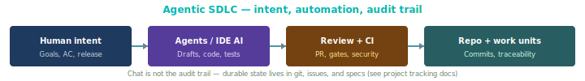

# Agentic SDLC (cross-cutting)

## What we mean by “agentic”

**Agentic SDLC** describes delivery where **software agents** (LLM-based assistants, codegen bots, review bots, test generators) are part of the ** toolchain**, alongside humans. It is **not** a replacement for **Scrum**, **Kanban**, **XP**, or **phased** models — it is a **layer** on how work is **executed** and **governed**.

Principles:

1. **Humans own intent** — product goals, acceptance, ethics, and release decisions.  
2. **Agents amplify execution** — code, tests, drafts, refactors — under **policies** (review, CI, security).  
3. **Same lifecycle** — Phases A–F ([`SDLC.md`](../SDLC.md)) still apply; agents change **throughput**, not the need for **specs**, **tests**, and **traceability** when your domain requires them.  
4. **Transparency** — commits, PRs, and CI should remain **inspectable**; avoid “black box” changes without audit trail.

## Process diagram (handbook)

*Human intent → agents/tools → review & CI → repository with work-unit linkage. Chat is not the system of record.*

---

## Relationship to engineering tracking

Repos may adopt an optional **tracking foundation** under `sdlc/` (see [`templates/sdlc/` on GitHub](https://github.com/autowww/blueprints/tree/main/sdlc/templates/sdlc)):

| Concept | Role in agentic workflows |
|---------|---------------------------|
| **Contributor** | Still **human identity** (e.g. git email); agents may use **bot** accounts — policy should say how those are labeled. |
| **Events** | Commits and CI runs remain **evidence**; agent-generated commits should be **reviewable** like any other change. |
| **Work units** | Link to backlog / REQ ids so automation doesn’t **orphan** changes from intent. |

**Time:** commit timestamps are **not** duration; explicit time logging (if needed) is separate — see [`TRACKING-FOUNDATION.md`](../../../sdlc/TRACKING-FOUNDATION.md) (duration section) in projects that include it.

---

## Ceremonies under higher automation

| Ceremony type | What changes | What does not |
|---------------|--------------|----------------|
| **Planning** | Estimates may need **recalibration** (smaller slices, faster coding). | **Goals** and **scope** still need human agreement. |
| **Review / retro** | Discussion may include **CI flakiness**, **agent mistakes**, **prompt hygiene**. | **Psychological safety** and **process improvement** remain human. |
| **Quality** | More reliance on **automated** gates; **human** review for riskier areas. | **Definition of Done** still enforced. |

---

## Risks (see also project `TRACKING-CHALLENGES`)

- **Review bottleneck** — agent speed outpaces human review; address with **smaller PRs**, **pairing**, **WIP limits** on review.  
- **Metric gaming** — commit volume can rise without value; prefer **work-unit completion** and **outcomes**.  
- **Compliance** — regulated domains still need **sign-offs** and **evidence** outside chat logs.

---

## External reading (tools and practice)

| Topic | Starting point | Executive summary (why it’s linked here) |
|-------|----------------|------------------------------------------|
| AI + SDLC (general) | Search for “LLM software development lifecycle” + your stack; prefer **vendor-neutral** guidance for policy. | No single canonical URL—**find guidance** that matches your stack and policy; avoid vendor lock-in as “the” SDLC. |
| Secure use of AI coding | [OWASP Top 10 for LLM](https://owasp.org/www-project-top-10-for-large-language-model-applications/) | **Security risks** when LLMs touch design, code, or data—baseline for agentic / AI-assisted workflows in this blueprint. |

---

## Related blueprint guides

- [Markdown-canonical workspace policy](markdown-canonical-workspace-policy.md) — **optional** repo profile: Markdown-only canonical artifacts, import normalization, canonicalization ledger rules, Forge vocabulary; use as **`AGENTS.md`** / prompt preamble when adopted.  
- [Cursor history import prompt](../templates/forge/forge-cursor-history-import.prompt.md) — reconstruct **Cursor** history from `imports/cursor-history/raw/` into **`normalized/`**, **`IMPORT-LEDGER.md`**, and canonical **`docs/`** Markdown (idempotent).  
- [Agentic coding standards](agentic-coding-standards.md) — **prescriptive** coding, review, verification, and security expectations for AI-assisted implementation (any methodology; Forge overlay included).  
- [Spec-driven development](spec-driven-development.md) — **durable specs in the repo** (acceptance criteria, IDs) before large agent-driven edits; complements this guide. Handbook: [`../docs/spec-driven.html`](../docs/spec-driven.html).  
- [Roles & archetypes](roles-archetypes.md) — human **accountability** vs **Contributor** identity when agents commit.  
- [Ceremonies hub](https://blueprints.forgesdlc.com/sdlc--methodologies-ceremonies.html) — **foundation** intents vs methodology **forks**; where humans stay in the loop for planning and acceptance.  
- [Agile (umbrella)](agile.md)  
- [Scrum](scrum.md) · [Kanban](kanban.md) · [XP](xp.md) · [Phased delivery](phased-delivery.md)  
- **Execution layer (optional):** containerized recipes and `agents/` workspace — see [`blueprints/agents/STRUCTURE.md`](../../agents/STRUCTURE.md) and handbook [`../docs/agents.html`](../docs/agents.html).