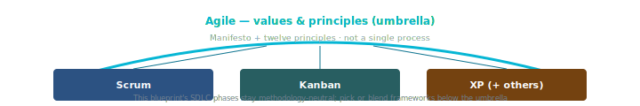

# Agile (umbrella)

## What it is

**Agile** is a set of **values and principles** for software development, not a single process. The [**Manifesto for Agile Software Development**](https://agilemanifesto.org/) (2001) prioritizes:

- **Individuals and interactions** over processes and tools  
- **Working software** over comprehensive documentation  
- **Customer collaboration** over contract negotiation  
- **Responding to change** over following a plan  

The [**Twelve Principles**](https://agilemanifesto.org/principles.html) behind the manifesto expand on delivery, sustainability, and technical excellence.

**Scrum**, **Kanban**, and **XP** are **compatible** frameworks/practices that operationalize Agile ideas in different ways. Teams often **blend** them (e.g. Scrum cadence + XP engineering practices + Kanban flow metrics).

## Process diagram (handbook)

*Values and principles span concrete frameworks — [`methodologies-agile.html`](../docs/methodologies-agile.html) shows this alongside deeper prose.*

---

## Authoritative sources (external)

| Resource | Executive summary (why it’s linked here) |
|----------|------------------------------------------|
| [Agile Manifesto](https://agilemanifesto.org/) | Original **four values** (2001)—defines “Agile” before you choose Scrum, Kanban, or phased delivery. |
| [Agile Alliance](https://www.agilealliance.org/) | Nonprofit **hub** for articles, glossary, community—neutral background for vocabulary shared with this blueprint. |
| [Scrum.org — What is Scrum?](https://www.scrum.org/resources/what-is-scrum) | **One framework** often used under Agile values—helps readers who picked Scrum as their cadence. |

---

## How this blueprint relates

[`SDLC.md`](../SDLC.md) is **methodology-neutral** at the phase level: you can run Phases A–F with **Scrum Sprints**, **Kanban** flow, or **phased** gates. The blueprint **does not** require Agile certification or a specific tool.

**Choosing a primary rhythm:**

| If you need… | Often start with… |
|--------------|-------------------|
| Fixed iterations, stakeholder demos every few weeks | Scrum |
| Continuous flow, variable intake | Kanban |
| Strong engineering discipline | XP practices + either cadence |
| Formal gates and baselines | Phased / hybrid |

**Roles:** blending frameworks still means naming **who** holds each **archetype**—see [`roles-archetypes.md`](roles-archetypes.md) (per-archetype detail + [Methodology roll-up](roles-archetypes.md#methodology-roll-up-all-archetypes-at-a-glance)).

**Ceremonies:** pick **intent types** from [`ceremonies/ceremony-foundation.md`](ceremonies/ceremony-foundation.md), use [`ceremonies/methodology-bridge.md`](ceremonies/methodology-bridge.md) to align vocabulary across frameworks, then map your blend with the **forks** in [`ceremonies/README.md`](ceremonies/README.md).

---

## Agentic SDLC

See [**Agentic SDLC**](agentic-sdlc.md) for how **AI-assisted** development intersects Agile values (feedback, working software, sustainable pace) without replacing human judgment.

---

## Further reading

- [Agile Alliance — Subway map to Agile practices](https://www.agilealliance.org/subway) — **Visual map** of practices; orientation only, not a workflow mandate.  
- Deep dives: [Scrum](scrum.md), [Kanban](kanban.md), [XP](xp.md), [Phased delivery](phased-delivery.md)
