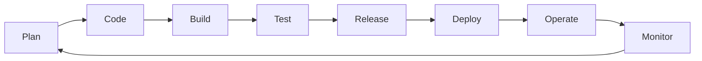
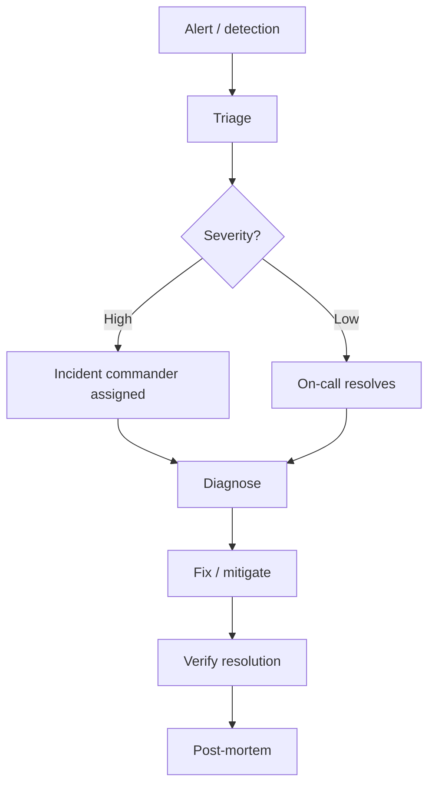
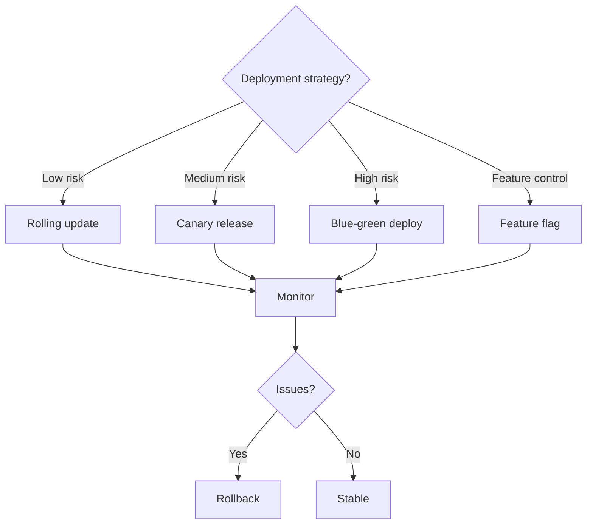
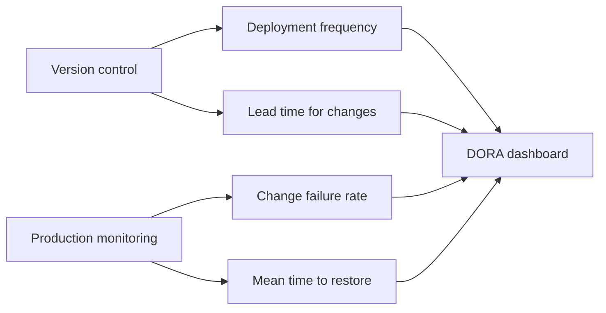

# DevOps — major processes & flow maps

## 1. CI/CD pipeline (conceptual)

## 2. DevOps infinity loop

## 3. Incident response flow

## 4. Deployment strategy decision

## 5. Phases A–F (DevOps emphasis)

| Blueprint phase | DevOps emphasis | Key practice |
|-----------------|-----------------|-------------|
| A Shape | Include operability requirements (SLOs, monitoring needs) | Shift-left on operational thinking |
| B Plan | Pipeline design; deployment strategy; environment planning | IaC from the start |
| C Build | CI: automated build, test, scan on every commit | Trunk-based development; small, frequent commits |
| D Verify | Automated test pyramid; security scanning; performance testing | Quality gates in the pipeline |
| E Release | CD: automated deployment; canary/blue-green; feature flags | Make deployments boring |
| F Learn | Monitoring, alerting, incident response, post-mortems | Production feedback closes the loop |

## 6. DORA metrics collection

## 7. Flow details (walkthrough)

**CI/CD pipeline** — Every commit triggers an automated pipeline. Build, test, scan, deploy in sequence. Failures at any stage block progression. The pipeline is the **single source of truth** for deployment readiness.

**Infinity loop** — DevOps is not a linear process; it is a continuous cycle. Planning incorporates operational learnings. Code includes infrastructure. Testing includes production-like environments. Monitoring informs the next planning cycle.

**Incident response** — Structured, not ad-hoc. Severity determines response level. Incident commanders coordinate complex responses. Post-mortems extract learning from every significant incident.

**Deployment strategies** — Choose based on risk tolerance. Rolling updates are simplest. Canary releases test with a subset of traffic. Blue-green provides instant rollback. Feature flags decouple deployment from user-visible release.

## 8. Authoritative sources & further reading

- [Wikipedia — DevOps](https://en.wikipedia.org/wiki/DevOps) — Stable overview of practices and culture.
- [Wikipedia — CI/CD](https://en.wikipedia.org/wiki/CI/CD) — Continuous integration and delivery.
- [DORA — State of DevOps](https://dora.dev/) — Research-backed metrics and capabilities.
- [Google SRE Book](https://sre.google/sre-book/table-of-contents/) — Free online; SRE practices and principles.

Full curated list: [`REFERENCE-LINKS.md`](../REFERENCE-LINKS.md).

## 9. Internal links

- [Ceremonies](ceremonies-prescriptive.md) · [Overview](https://forgesdlc.com/methodologies-devops.html)
