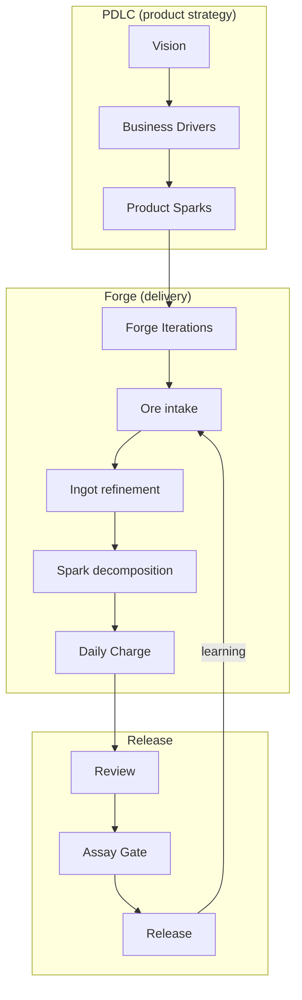

# Planning flow — vision to daily Sparks

This document describes the complete pipeline from a product vision through business drivers, Product Sparks, Forge iterations, and down to daily Charge execution.

## The pipeline

## Level 1: Business Drivers → Product Sparks

Business drivers come from PDLC P1–P3 (problem discovery, solution validation, strategy). Each driver is decomposed into **Product Sparks** — potentially shippable product iterations.

| Approach | Product Spark type | Duration | Evidence focus |
|----------|--------------------|----------|----------------|
| **PoC** | Hypothesis validation | 1–4 weeks | Learning: did we answer the key question? |
| **MVP** | Core value delivery | 4–12 weeks | Adoption: do users get value from the minimum feature set? |
| **Phased** | Incremental capability | Per phase (weeks–months) | Completeness: is this phase releasable? |

**Decision:** Which approach to use is a Product hat decision, informed by Bellows challenge (BA for requirements clarity, Architecture for feasibility, PM for constraints).

## Level 2: Product Sparks → Forge Iterations

Each Product Spark is delivered through one or more **Forge iterations** (1–2 week cycles). The iteration boundary is where scope is confirmed and evidence is assessed.

| Product Spark stage | Iterations typical | Planning emphasis |
|---------------------|-------------------|-------------------|
| **PoC** | 1–2 | Discover and verify Sparks dominate |
| **MVP** | 3–6 | Build and verify Sparks dominate; Assay Gate per iteration |
| **Phase** | Variable | All phase types balanced; release Sparks at end |

## Level 3: Forge Iterations → Ore → Ingots → Sparks → Charge

Within each iteration:

1. **Ore intake** — continuous; captures new ideas, defects, and learnings.
2. **Refinement** — selected Ore becomes Ingots with acceptance criteria.
3. **Planning** — Ingots decomposed into phase-tagged Sparks; iteration scope locked.
4. **Daily execution** — Sparks pulled into the Charge; hat-switching; Bellows challenges.
5. **Review** — evidence assessed.
6. **Assay Gate** — release decision.
7. **Retro** — learning feeds new Ore.

## Mapping to WBS

| Forge concept | WBS equivalent | ID example |
|---------------|---------------|------------|
| Product Spark | Milestone | `M1` |
| Ingot | Epic or Story | `M1E1` or `M1E1S1` |
| Spark | Task | `M1E1S1T1` |
| Forge iteration | Sprint / time window | `F1`, `F2` |

Forge does **not** impose a new ID scheme. Use your project's existing WBS conventions.

## Planning ceremony integration

| Planning level | Who leads | Ceremony |
|----------------|----------|----------|
| Business drivers → Product Sparks | Product hat | Outside iteration; strategic planning |
| Product Spark → iteration scope | Product + Engineering hats | Iteration planning (start of each cycle) |
| Iteration → Ore → Ingots | Product hat + Bellows | Refinement sessions |
| Ingots → Sparks | Engineering hat | Planning ceremony |
| Sparks → Charge | Engineering hat | Daily sync |

## References

- [`../FORGE-SDLC-PDLC-BRIDGE.md`](../FORGE-SDLC-PDLC-BRIDGE.md) — how Forge connects to PDLC
- [`../../../pdlc/PDLC-SDLC-BRIDGE.md`](../../../../pdlc/PDLC-SDLC-BRIDGE.md) — cross-lifecycle bridge
- [`../ceremonies-prescriptive.md`](../ceremonies-prescriptive.md) — ceremony details
