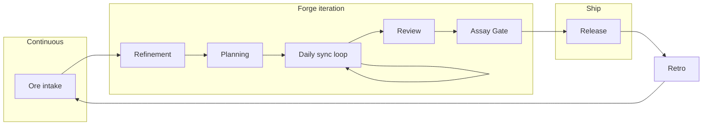
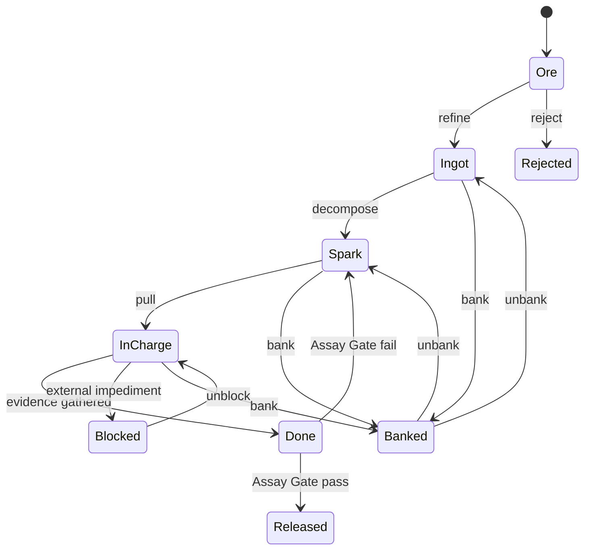
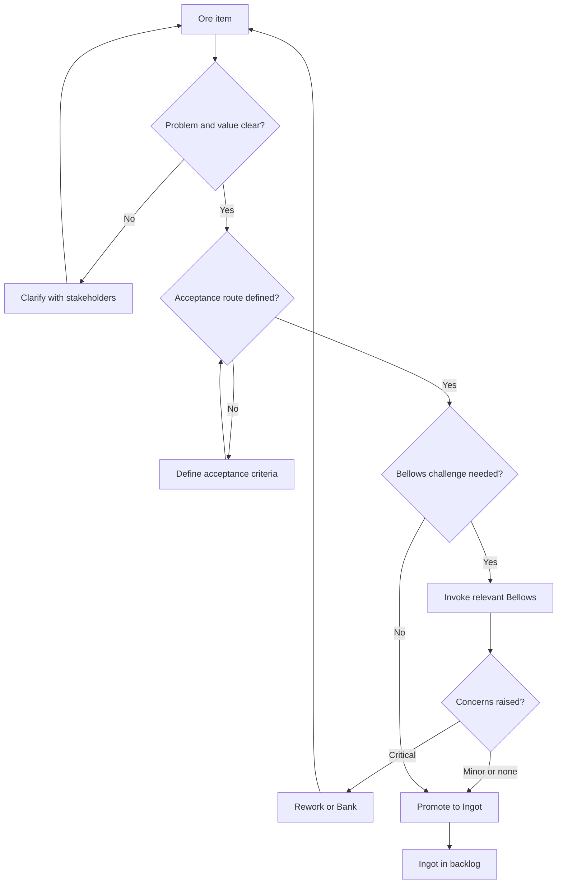
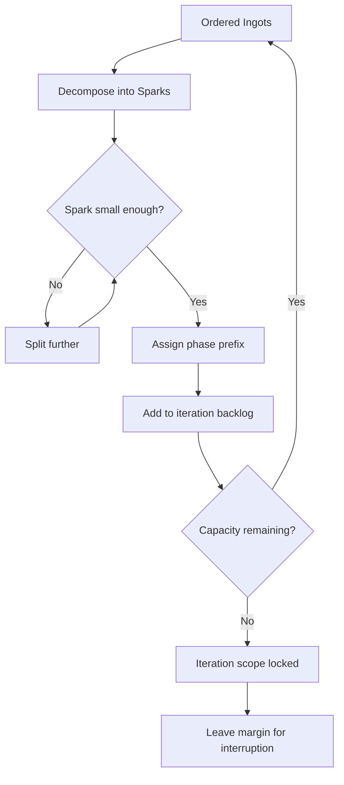
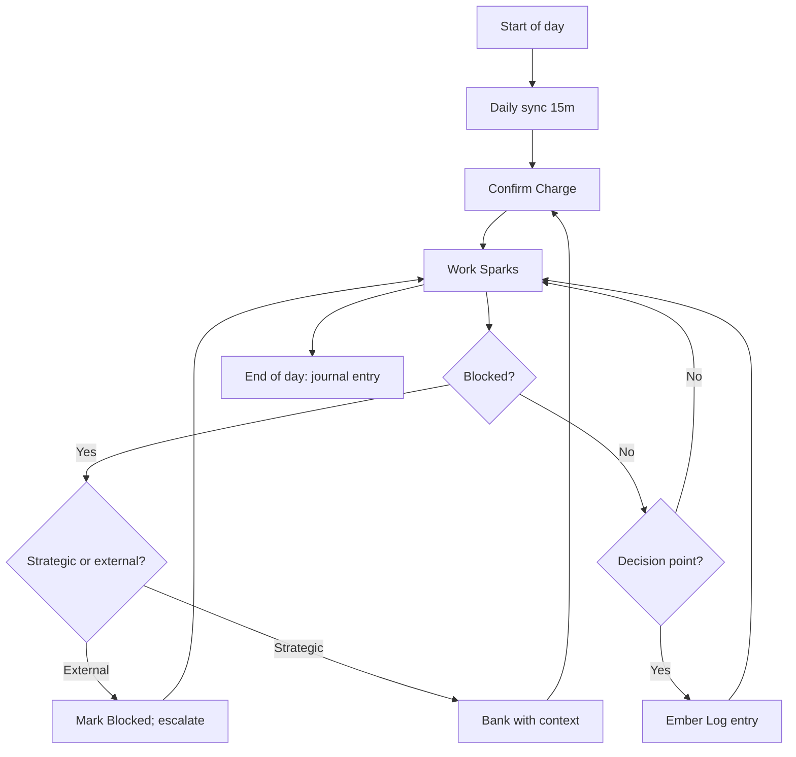
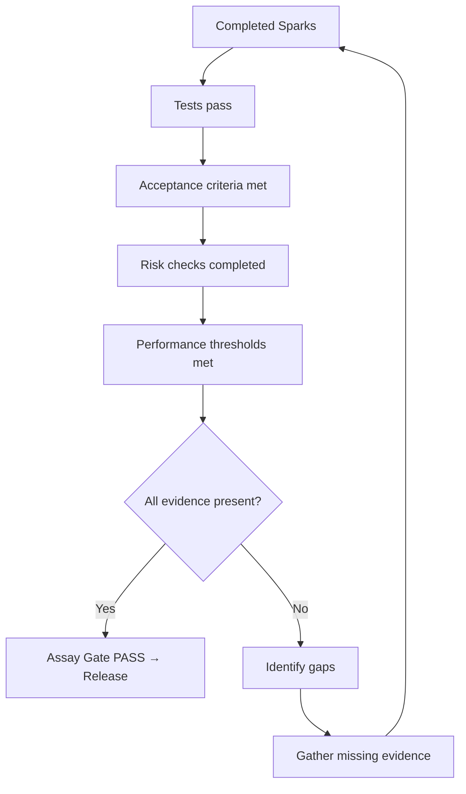
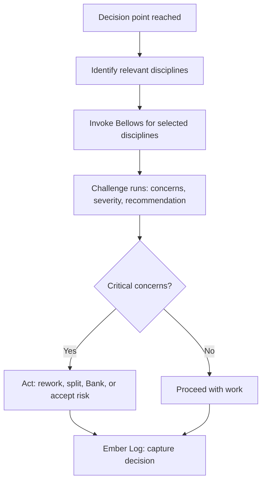

# Forge — major processes & flow maps

Mermaid diagrams below render on GitHub and in many Markdown viewers.

## 1. Forge iteration lifecycle (high level)



## 2. Work unit hierarchy

```
Product backlog
  └── Ore              (raw, unrefined)
        └── Ingot      (refined, plannable)
              └── Spark (executable, testable)

Daily execution
  └── Charge           (today's selected Sparks)

Time horizon
  └── Forge iteration  (one delivery cycle containing Sparks across phases A–F)
```

| Level | Forge term | Comparable concept | Typical lifespan |
|-------|------------|-------------------|------------------|
| **Coarsest** | Ore | Epic or feature request (pre-refinement) | Days to weeks |
| **Mid** | Ingot | User story or feature (refined, ready) | One iteration |
| **Finest** | Spark | Task or sub-task (executable) | One focused session (~1–4 hours) |
| **Daily set** | Charge | Daily commitment | One day |
| **Cycle** | Forge iteration | Sprint or release cycle | 1–2 weeks |

### Spark = Task (WBS mapping)

In projects with an existing **milestone → epic → story → task** hierarchy, Forge terms map directly — no parallel namespace:

| Existing level | Forge equivalent | ID example |
|----------------|-----------------|------------|
| Epic / feature request | **Ore** | `M1E3` (pre-refinement) |
| Story (refined) | **Ingot** | `M1E3S2` |
| Task (implementation slice) | **Spark** | `M1E3S2T4` |

Spark IDs inherit from the WBS scheme. Spark-specific data (state, DoD, journal) lives in `forge-logs/`, not in the requirements tree. If existing Stories already carry clear acceptance criteria, they are effectively Ingots — no extra ceremony needed.

## 3. State model



| State | Meaning |
|-------|---------|
| **Ore** | Raw, unrefined input |
| **Ingot** | Refined, plannable work |
| **Spark** | Decomposed, executable work |
| **In Charge** | Active in today's daily set |
| **Blocked** | External impediment prevents progress |
| **Banked** | Intentionally paused with preserved context (strategic) |
| **Done** | Evidence gathered, ready for Assay Gate |
| **Released** | Passed Assay Gate, shipped |
| **Rejected** | Not viable; closed with reason |

## 4. Refinement flow (Ore → Ingot)



## 5. Planning flow (Ingot → Sparks → iteration scope)



## 6. Daily execution loop



## 7. Assay Gate flow



## 8. Bellows challenge flow



## 9. Cross-phase mapping (A–F) in one iteration

| Phase | Where it happens in Forge |
|-------|---------------------------|
| A Discover | Continuous Ore intake + `discover:` Sparks |
| B Specify | Refinement (Ore → Ingot) + `specify:` Sparks |
| C Design | Planning decomposition + `design:` Sparks |
| D Build | Charge execution + `build:` Sparks |
| E Verify | Assay Gate + `verify:` Sparks |
| F Release | Assay Gate pass + `release:` Sparks |

## 10. Flow details (walkthrough)

**Iteration lifecycle** — Ore intake is continuous; Refinement shapes selected Ore into Ingots with enough clarity for Planning. Inside the iteration, daily syncs confirm the Charge and surface blockers. Review assesses evidence quality; the Assay Gate makes the strict release decision. Retro captures learning that feeds back as new Ore.

**Work unit hierarchy** — Forge terms layer on existing WBS conventions. Ore maps to pre-refinement epics/features; Ingots to refined stories; Sparks to tasks. The Charge is a daily view, not a separate backlog. Forge iterations align with milestones in the project's existing structure.

**State model** — The key distinctions from a simple Kanban board: (1) Banked vs Blocked separates strategic pause from external impediment, (2) Done is not Released until the Assay Gate passes, and (3) Rejected items are closed with a reason rather than silently deleted.

**Bellows challenge** — Bellows are invoked at decision points (refinement, pre-build, pre-release), not on every action. Each Bellows references its discipline's bridge document to calibrate challenge intensity to the current SDLC phase.

## 11. Links

- [Ceremonies detail](ceremonies-prescriptive.md) · [Foundation](foundation-connection.md) · [Overview](../forge.md)
