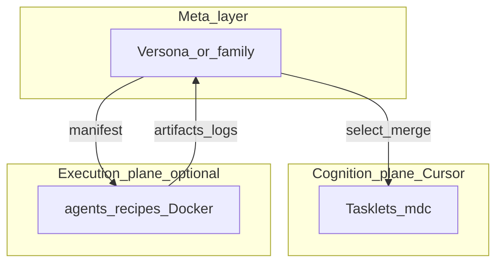
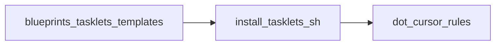

# Forge tasklets — small Cursor operations

**Tasklets** are **single-operation** Cursor rules (`.mdc`) with a **fixed output shape**. A **meta-Versona** (for example **Sampling Versona**) can invoke them **in sequence** and merge results into a [`Versona`-style report](../versona/VERSONA-CONTRACT.md).

They are **not** a replacement for discipline Versonas (Product Management, BA, Testing, …). Use them as **building blocks** and teaching aids.

Full taxonomy (execution plane, operation class, discipline overlay): [`TASKLET-TAXONOMY.md`](TASKLET-TAXONOMY.md).

### Mental model: layers



### Install: file flow



## Install (project root)

From a repository that already contains the `blueprints/` submodule (run at **repository root**):

```bash
bash blueprints/sdlc/methodologies/forge/tasklets/install-tasklets.sh
```

Options:

| Flag | Effect |
|------|--------|
| `--dry-run` | Print planned copies only |
| `--force` | Overwrite existing files in `.cursor/rules/` |
| `--no-sampling` | Install only tasklets; skip `versona-sampling.mdc` |

Optional target directory (default: current directory):

```bash
bash blueprints/sdlc/methodologies/forge/tasklets/install-tasklets.sh /path/to/repo
```

## What gets installed

| Installed file | Purpose |
|----------------|---------|
| `.cursor/rules/forge-tasklet-extract-assumptions.mdc` | Pull explicit/implicit assumptions from text or context |
| `.cursor/rules/forge-tasklet-list-unknowns.mdc` | List unknowns, missing evidence, unresolved decisions |
| `.cursor/rules/forge-tasklet-quick-triage.mdc` | Short severity triage table (max five signals) |
| `.cursor/rules/versona-sampling.mdc` | Demo **meta-Versona** that runs the three tasklets and merges output |

After install, tune **`globs:`** in each `.mdc` for your repo (defaults are empty = manual / @-rule invocation).

## Bundled meta-Versona

See **[`versona-sampling.mdc.template`](../versona/versona-sampling.mdc.template)** — **Sampling Versona** demonstrates **meta-Versona + tasklets** with a simple, readable flow. Install copies it to `.cursor/rules/versona-sampling.mdc`.

## Relationship to execution-plane work

Tasklets in this folder are **cognition-plane** (in-IDE LLM only). **Docker / browser / API** steps belong in [`blueprints/agents/`](../../../../agents/README.md) recipes; a Versona can reference those as **execution tasklets** with a manifest — see [`agents/docs/VERSONA-EXECUTION-TASKLETS.md`](../../../../agents/docs/VERSONA-EXECUTION-TASKLETS.md).

## See also

- [`../versona/README.md`](../versona/README.md) — Versona catalog
- [`../versona/VERSONA-CONTRACT.md`](../versona/VERSONA-CONTRACT.md) — output shape for full discipline Versonas
- [`../setup/README.md`](../setup/README.md) — Forge adoption and `forge-init.sh`
