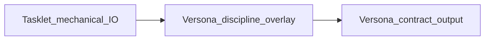
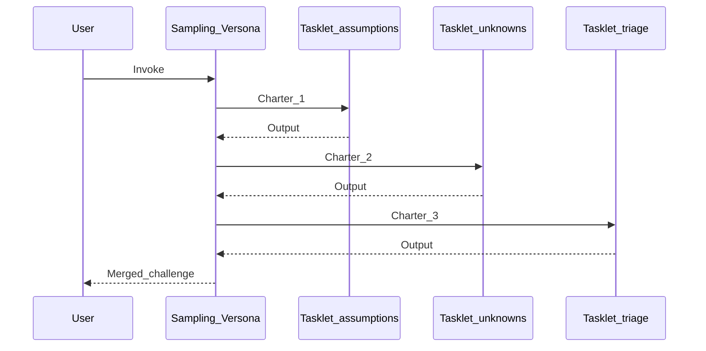
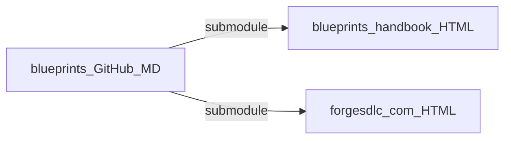

# Versonas — discipline challenge agents

**Versonas** are AI challenge agents that pressure-test work from discipline-specific perspectives. They are **not** team roles — they are challenge functions that strengthen thinking before costly commitments.

## How Versonas work

1. A **decision point** is reached (refinement, pre-build, pre-release, architecture choice).
2. The team identifies which **discipline perspectives** are relevant.
3. The appropriate Versonas are **invoked** (via Cursor rule or manual prompt).
4. Each Versona **challenges** the work from its discipline's perspective, producing structured output.
5. The team **acts** on concerns or accepts the risk, capturing the decision in the Ember Log.

## Bridge-awareness

Each Versona template references its discipline's **bridge document** (`*-SDLC-PDLC-BRIDGE.md`). The bridge contains a **phase alignment table** that tells the Versona agent *when* its discipline is most relevant:

- **Architecture** Versona is strongest at phases A–C (discover, specify, design), lighter at D–F.
- **Testing** Versona activates at phases D–E (build, verify) and during Assay Gate.
- **BA** Versona is strongest at phases A–B (discover, specify) and at Review.

This phase-awareness lets Versonas calibrate challenge intensity based on the current Spark's phase prefix (`discover:`, `build:`, `verify:`, etc.).

## Template catalog

### Engineering family (7 disciplines)

| Template | Discipline | Core challenge |
|----------|-----------|----------------|
| [`versona-se.mdc.template`](https://github.com/autowww/blueprints/blob/main/sdlc/methodologies/forge/versona/versona-se.mdc.template) | Software Engineering | Are CS fundamentals and craft practices sound? |
| [`versona-architecture.mdc.template`](https://github.com/autowww/blueprints/blob/main/sdlc/methodologies/forge/versona/versona-architecture.mdc.template) | Software Architecture | Is this structurally sound and maintainable? |
| [`versona-devops.mdc.template`](https://github.com/autowww/blueprints/blob/main/sdlc/methodologies/forge/versona/versona-devops.mdc.template) | DevOps | Can we deliver and operate this reliably? |
| [`versona-testing.mdc.template`](https://github.com/autowww/blueprints/blob/main/sdlc/methodologies/forge/versona/versona-testing.mdc.template) | Testing & QA | Can we prove this works correctly? |
| [`versona-frontend.mdc.template`](https://github.com/autowww/blueprints/blob/main/sdlc/methodologies/forge/versona/versona-frontend.mdc.template) | Frontend | Is the web UI fast, accessible, and maintainable? |
| [`versona-mobile.mdc.template`](https://github.com/autowww/blueprints/blob/main/sdlc/methodologies/forge/versona/versona-mobile.mdc.template) | Mobile | Is the mobile experience performant and reliable? |
| [`versona-iot.mdc.template`](https://github.com/autowww/blueprints/blob/main/sdlc/methodologies/forge/versona/versona-iot.mdc.template) | Embedded / IoT | Is this reliable and safe for constrained environments? |

### Data family (2 disciplines)

| Template | Discipline | Core challenge |
|----------|-----------|----------------|
| [`versona-bigdata.mdc.template`](https://github.com/autowww/blueprints/blob/main/sdlc/methodologies/forge/versona/versona-bigdata.mdc.template) | Big Data & Data Engineering | Is data engineered, governed, and processed correctly? |
| [`versona-datascience.mdc.template`](https://github.com/autowww/blueprints/blob/main/sdlc/methodologies/forge/versona/versona-datascience.mdc.template) | Data Science & ML | Are models valid, reproducible, and responsible? |

### Product family (5 disciplines)

| Template | Discipline | Core challenge |
|----------|-----------|----------------|
| [`versona-product-management.mdc.template`](https://github.com/autowww/blueprints/blob/main/sdlc/methodologies/forge/versona/versona-product-management.mdc.template) | Product Management | Are we building the right product for the right market? |
| [`versona-ba.mdc.template`](https://github.com/autowww/blueprints/blob/main/sdlc/methodologies/forge/versona/versona-ba.mdc.template) | Business Analysis | Do we understand what stakeholders need? |
| [`versona-ux.mdc.template`](https://github.com/autowww/blueprints/blob/main/sdlc/methodologies/forge/versona/versona-ux.mdc.template) | UX / UI Design | Is this usable, desirable, and accessible? |
| [`versona-marketing.mdc.template`](https://github.com/autowww/blueprints/blob/main/sdlc/methodologies/forge/versona/versona-marketing.mdc.template) | Marketing | Can we acquire, engage, and retain users? |
| [`versona-cs.mdc.template`](https://github.com/autowww/blueprints/blob/main/sdlc/methodologies/forge/versona/versona-cs.mdc.template) | Customer Success | Will users achieve their goals? |

### Governance family (1 discipline)

| Template | Discipline | Core challenge |
|----------|-----------|----------------|
| [`versona-pm.mdc.template`](https://github.com/autowww/blueprints/blob/main/sdlc/methodologies/forge/versona/versona-pm.mdc.template) | Project Management | Are we delivering within constraints? |

### Cross-cutting (2 disciplines)

| Template | Discipline | Core challenge |
|----------|-----------|----------------|
| [`versona-security.mdc.template`](https://github.com/autowww/blueprints/blob/main/sdlc/methodologies/forge/versona/versona-security.mdc.template) | Security | Is this safe from attacks and breaches? |
| [`versona-compliance.mdc.template`](https://github.com/autowww/blueprints/blob/main/sdlc/methodologies/forge/versona/versona-compliance.mdc.template) | Compliance | Does this meet regulatory obligations? |

### Methodology / demo (1)

| Template | Discipline | Core challenge |
|----------|-----------|----------------|
| [`versona-sampling.mdc.template`](https://github.com/autowww/blueprints/blob/main/sdlc/methodologies/forge/versona/versona-sampling.mdc.template) | Sampling (demo) | What assumptions, unknowns, and top signals appear before a full Versona pass? |

### Family aggregators

| Template | Activates |
|----------|-----------|
| [`versona-family-engineering.mdc.template`](https://github.com/autowww/blueprints/blob/main/sdlc/methodologies/forge/versona/versona-family-engineering.mdc.template) | All 7 engineering Versonas |
| [`versona-family-data.mdc.template`](https://github.com/autowww/blueprints/blob/main/sdlc/methodologies/forge/versona/versona-family-data.mdc.template) | Both data Versonas |
| [`versona-family-product.mdc.template`](https://github.com/autowww/blueprints/blob/main/sdlc/methodologies/forge/versona/versona-family-product.mdc.template) | All 5 product Versonas |
| [`versona-all.mdc.template`](https://github.com/autowww/blueprints/blob/main/sdlc/methodologies/forge/versona/versona-all.mdc.template) | Master routing — suggests which Versonas based on context |

## Tasklets (example bundle)

Small **single-operation** Cursor rules and an installer script live in [`../tasklets/README.md`](../tasklets/README.md). They demonstrate how a **meta-Versona** (e.g. **Sampling**) can chain **tasklets** before deeper discipline Versonas.

- **Install:** `bash blueprints/sdlc/methodologies/forge/tasklets/install-tasklets.sh` from the consuming repo root (requires `blueprints/` submodule).
- **Docs:** [`../tasklets/README.md`](../tasklets/README.md) · [`../tasklets/TASKLET-TAXONOMY.md`](../tasklets/TASKLET-TAXONOMY.md)
- **Product `globs`:** [`RECOMMENDED-GLOBS.md`](RECOMMENDED-GLOBS.md)
- **Align rules with `forge.config.yaml`:** [`../setup/CURSOR-RULES-ALIGNMENT.md`](../setup/CURSOR-RULES-ALIGNMENT.md)

### Discipline overlay (neutral tasklets + normative Versona)

### Sampling Versona sequence (demo)

### Where documentation is published

## Adopting Versonas in a consuming repo

1. Copy the templates you need to `.cursor/rules/` in your repo (remove `.template` suffix).
2. **Optional:** Install the example tasklets + Sampling Versona via [`tasklets/install-tasklets.sh`](tasklets/install-tasklets.sh).
3. Update `globs:` in each rule to match your project's file structure.
4. Configure which Versonas are active in `forge.config.yaml` (via the setup wizard).
5. Use family aggregators to activate discipline groups without configuring each individually.

See [`VERSONA-CONTRACT.md`](VERSONA-CONTRACT.md) for the standard structure every Versona rule must follow.
