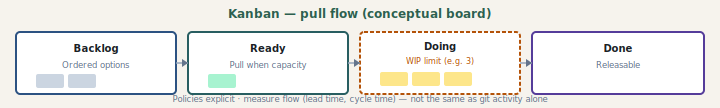

# Kanban

## What it is

**Kanban** is a strategy for optimizing **flow** of value through a **pull** system: visualize work, **limit work in progress (WIP)**, manage flow, make policies explicit, implement feedback loops, and improve collaboratively. It is **not** inherently time-boxed like Scrum; cadence can be **continuous** or **regular** (replenishment meetings) depending on context.

Use Kanban when **demand is variable**, **priorities shift often**, or **service / ops** work dominates predictable product increments.

## Process diagram (handbook)

*Columns, WIP limits, and policies are team-specific; cycle time comes from the board, not from git alone.*

---

## Authoritative sources (external)

| Resource | Executive summary (why it’s linked here) |
|----------|------------------------------------------|
| [Kanban Guide for Scrum Teams](https://www.scrum.org/resources/kanban-guide-scrum-teams) | How **Kanban flow** practices integrate **with** Scrum—essential when you blend both under one cadence. |
| [Kanban — Agile Alliance glossary](https://www.agilealliance.org/glossary/kanban/) | Short **definition** and manufacturing roots—quick grounding before deeper guides. |
| [Kanban University — The Kanban Guide](https://kanban.university/kanban-guide) | **Current** Kanban Guide text—method practices and evolution of the Guide. |
| [ProKanban.org](https://prokanban.org/) | **Professional** Kanban community—training and certification; optional depth. |

---

## Core practices (summary)

| Practice | Meaning |
|----------|---------|
| **Visualize** | Board (physical or tool) with **columns** representing workflow states. |
| **Limit WIP** | Cap items per column or per person to reduce context-switching and surface bottlenecks. |
| **Manage flow** | Measure and improve **throughput**, **lead time**, **cycle time** — not just “busy.” |
| **Make policies explicit** | Definition of ready/done, who pulls work, SLAs. |
| **Feedback loops** | Replenishment, service delivery review, operations review. |
| **Improve collaboratively** | Evolve process using data and team input. |

**Metrics that matter:** cycle time (start → done), throughput, aging of items. **Git commits** show **activity**, not **queue time** or **blocked** time — blockers usually live on the **board** or in the **tracker**.

---

## Mapping to this blueprint’s SDLC

| Kanban idea | Blueprint touchpoint |
|-------------|----------------------|
| Continuous flow | Phases A–F still apply to **each** item; you are not forced into Sprints. |
| Policies / DoD | Align with handbook **Definition of done** and project CI gates. |
| Cadence | **Review cadence** ([`review.html`](../docs/review.html)) can follow **weekly** or **on-demand** replenishment instead of Sprint boundaries. |

**Ceremonies:** Kanban rituals mapped to neutral **intent types** — [`ceremonies/kanban.md`](ceremonies/kanban.md) · [foundation](ceremonies/ceremony-foundation.md).

**Roles:** how Kanban **tweaks** delivery **archetypes** (Demand, Build, Flow, Assure, Steer)—[`roles-archetypes.md`](roles-archetypes.md) §1–5 (Methodology tweaks column **Kanban**).

---

## Agentic SDLC: Kanban + agents + tracking

| Topic | Guidance |
|-------|----------|
| **Flow** | Agents can **increase completion rate**; if **review** or **test** columns become the bottleneck, WIP limits should include **“in review”** explicitly. |
| **Invisible work** | Agent runs may not appear on the board — decide whether **PR / CI jobs** are tracked as subtasks or policies. |
| **Cycle time** | Prefer **tracker** data (created → done). “First commit → merge” is a **rough** proxy only. |
| **Tracking foundation** | Same [`TRACKING-FOUNDATION`](../../../sdlc/TRACKING-FOUNDATION.md) spine; **rolling windows** replace Sprint windows for reports. |

---

## Scrum vs Kanban (when to blend)

Many teams use **Scrum** events with **Kanban** flow metrics, or **Scrumban** hybrids. This blueprint does not mandate either; [`agile.md`](agile.md) describes the umbrella. Pick **one primary** cadence for planning and retros, then add Kanban policies where flow matters most.

---

## Prescriptive deep dive (teams)

Package **[`kanban/README.md`](kanban/README.md)** — foundation fit, roles (SRM/team/coach), ceremonies (replenishment, stand-up, delivery review, SDR), process maps. Handbook: [`methodologies-kanban-foundation.html`](../docs/methodologies-kanban-foundation.html) through [`methodologies-kanban-process.html`](../docs/methodologies-kanban-process.html).

---

## Further reading

- [Scrum.org — Kanban Guide for Scrum Teams (PDF)](https://scrum.org/resources/kanban-guide-scrum-teams) — Same **Scrum+Kanban** integration guide; PDF format for offline reading.  
- Companion: [Scrum](scrum.md), [XP](xp.md), [Agentic SDLC](agentic-sdlc.md)