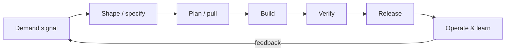
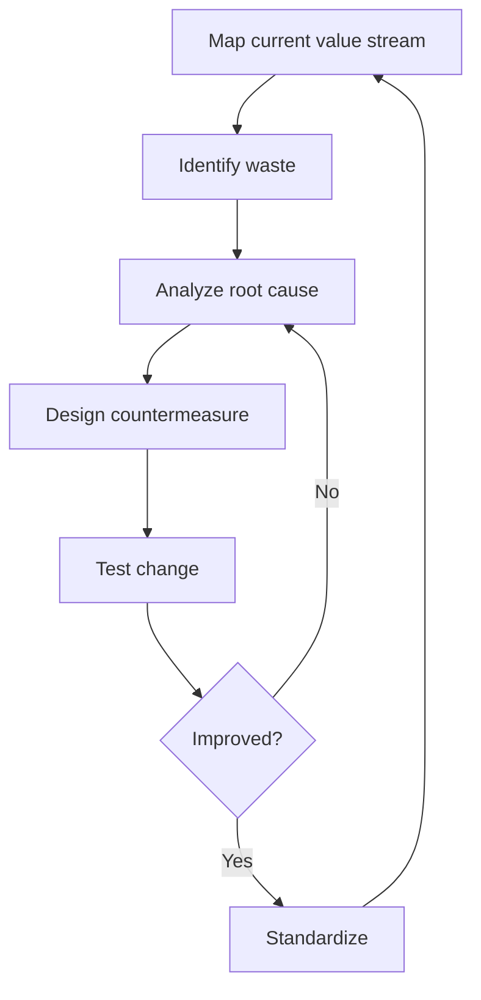
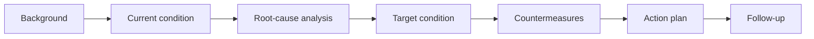
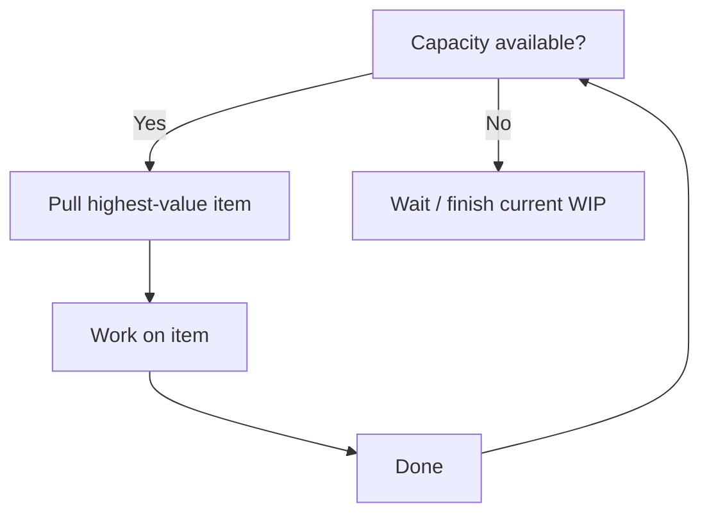

# Lean Software Development — major processes & flow maps

## 1. Value-stream overview (idea to production)

Lean measures **lead time** across the entire stream and **waiting time** between steps.

## 2. Waste identification loop

## 3. A3 problem-solving flow

## 4. Pull-based work selection

## 5. Phases A–F (Lean focus areas)

| Blueprint phase | Lean focus | Key metric |
|-----------------|-----------|------------|
| A Shape | Define value; avoid over-specification | Time from idea to "ready" |
| B Plan | Last responsible moment; pull-based commitment | Queue time before start |
| C Build | Small batches; eliminate task switching | Cycle time per item |
| D Verify | Built-in quality; catch defects at source | Defect escape rate |
| E Release | Automate deployment; reduce batch size | Deploy lead time |
| F Learn | Production feedback; close the loop | Time from deploy to insight |

## 6. Seven wastes in software (reference)

| Manufacturing waste | Software equivalent |
|--------------------|---------------------|
| Overproduction | Features nobody uses |
| Inventory | Partially done work (branches, specs not implemented) |
| Motion | Task switching between unrelated work |
| Waiting | Blocked items; waiting for review, approval, environment |
| Transportation | Unnecessary handoffs between teams or phases |
| Over-processing | Gold-plating; excessive ceremony for the risk level |
| Defects | Bugs, rework, misunderstood requirements |

## 7. Flow details (walkthrough)

**Value-stream overview** — Every piece of work flows from demand to delivery. Lean measures the total elapsed time, not just active work time. The gap between active and elapsed is waste (waiting, handoffs, queues).

**Waste identification** — Map the current state, identify waste using the seven-waste taxonomy, analyze root causes, design and test countermeasures, then standardize what works. This is a continuous cycle, not a one-time exercise.

**A3 problem-solving** — A structured approach to complex problems. The A3 paper format forces conciseness. Each section builds on the previous; the review validates reasoning quality.

**Pull-based selection** — Work is pulled when capacity exists, not pushed based on demand volume. WIP limits prevent overloading. This is the operational mechanism behind "deliver as fast as possible."

## 8. Authoritative sources & further reading

- [Wikipedia — Lean software development](https://en.wikipedia.org/wiki/Lean_software_development) — Overview of principles and history.
- [Wikipedia — Toyota Production System](https://en.wikipedia.org/wiki/Toyota_Production_System) — Manufacturing roots.
- [Wikipedia — Value-stream mapping](https://en.wikipedia.org/wiki/Value-stream_mapping) — The diagnostic tool for waste identification.
- [Lean Enterprise Institute](https://www.lean.org/) — Practitioner community.
- [Agile Alliance — Lean software development](https://www.agilealliance.org/glossary/lean-software-development/) — Glossary entry.

Full curated list: [`REFERENCE-LINKS.md`](../REFERENCE-LINKS.md).

## 9. Internal links

- [Ceremonies](ceremonies-prescriptive.md) · [Overview](../lean.md)
