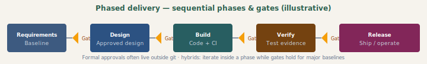

# Phased delivery (Waterfall-style and hybrids)

## What it is

**Phased delivery** (often associated with **Waterfall**) sequences work through **distinct phases** — e.g. requirements → design → implementation → verification → release — with **gates** between phases. Each phase produces **approved artifacts** before the next begins. This is common in **regulated** industries, **hardware–software** dependencies, **fixed-price** contracts, and **safety-critical** systems.

It contrasts with **iterative** Agile delivery: phases emphasize **upfront baselines** and **change control** over frequent increments.

## Process diagram (handbook)

*Sequential phases with gate approvals — names and formality vary; many orgs iterate inside a phase while keeping major baselines gated.*

---

## Authoritative sources (external)

| Resource | Executive summary (why it’s linked here) |
|----------|------------------------------------------|
| [ISO/IEC/IEEE 12207](https://www.iso.org/standard/63712.html) | **International standard** for software life-cycle processes—formal anchor for phased/regulated delivery (catalogue; full text is paid/licensed). |
| [Wikipedia — Waterfall model](https://en.wikipedia.org/wiki/Waterfall_model) | **Informal** history and diagram of sequential phases—context, not a normative standard. |
| [Wikipedia — Software development process](https://en.wikipedia.org/wiki/Software_development_process#Waterfall_development) | **Waterfall as one lifecycle** among many—helps compare with iterative approaches. |
| [Wikipedia — Agile software development](https://en.wikipedia.org/wiki/Agile_software_development) | **Contrast** between iterative Agile and plan-driven lifecycles—useful for hybrid (gates + iterations). |

**Reality:** Many organizations use **hybrids**: phased **gates** for compliance, **iterative** development **within** a phase.

---

## Typical phases (illustrative)

| Phase | Typical outputs |
|-------|-----------------|
| Requirements | Specs, traceability, hazard analysis (if applicable). |
| Design | Architecture, interfaces, detailed design. |
| Implementation | Code, unit tests per standard. |
| Verification | Integration, system test, validation evidence. |
| Release | Release notes, sign-off, deployment package. |

**Gates:** formal **reviews** or **approvals** (often documented outside git). **Git** shows **engineering activity**; it does not replace **signatures** or **baselines** stored in a **quality** or **ALM** system.

---

## Mapping to this blueprint’s SDLC

[`SDLC.md`](../SDLC.md) Phases A–F are **already** a **lightweight** lifecycle (discover → release). **Phased delivery** in the strict sense **narrows** parallel work: you may **freeze** requirements artifacts before bulk build, or require **phase exit criteria** per your standard.

| Strict phased idea | Blueprint alignment |
|--------------------|---------------------|
| Baselines | Versioned specs under `docs/requirements/`, change control ([`change.html`](../docs/change.html)). |
| Traceability | Requirements ↔ tests ↔ risks matrices. |
| Verification evidence | Test plans, CI reports, release checklist ([`release` docs in project]). |

**Ceremonies:** gates and reviews mapped to **intent types** — [`ceremonies/phased.md`](ceremonies/phased.md) · [foundation](ceremonies/ceremony-foundation.md).

**Roles:** how phased delivery **emphasizes Steer & govern** and **Assure**, and **splits Build** by handoffs—[`roles-archetypes.md`](roles-archetypes.md) §1–5 and [Methodology roll-up](roles-archetypes.md#methodology-roll-up-all-archetypes-at-a-glance).

---

## Agentic SDLC: phased + agents + tracking

| Topic | Guidance |
|-------|----------|
| **Gates** | Agent-generated code still passes **human** gate criteria (review, static analysis, required tests). |
| **Phase attribution** | Commits may touch multiple “phases” in file paths; **work unit** metadata (REQ id, phase tag) matters more than folder names. |
| **Documentation** | Agents can draft specs; **approval** remains a **human/compliance** step. |
| **Tracking foundation** | [`TRACKING-FOUNDATION`](../../../sdlc/TRACKING-FOUNDATION.md) supports **milestone windows** and **phase labels** on work units for reporting; **approvals** are out of band. |

---

## Prescriptive deep dive (teams)

Package **[`phased/README.md`](phased/README.md)** — stages vs A–F, gate roles, ceremonies (charter, TRR, UAT, PIR), flow maps. Handbook: [`methodologies-phased-foundation.html`](../docs/methodologies-phased-foundation.html) through [`methodologies-phased-process.html`](../docs/methodologies-phased-process.html).

---

## Further reading

- Project [`TRACKING-CHALLENGES.md`](../../../sdlc/TRACKING-CHALLENGES.md) — phased / Waterfall-oriented challenges  
- Companion: [Scrum](scrum.md), [Agentic SDLC](agentic-sdlc.md)
