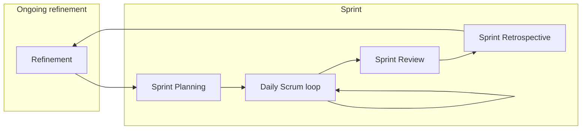
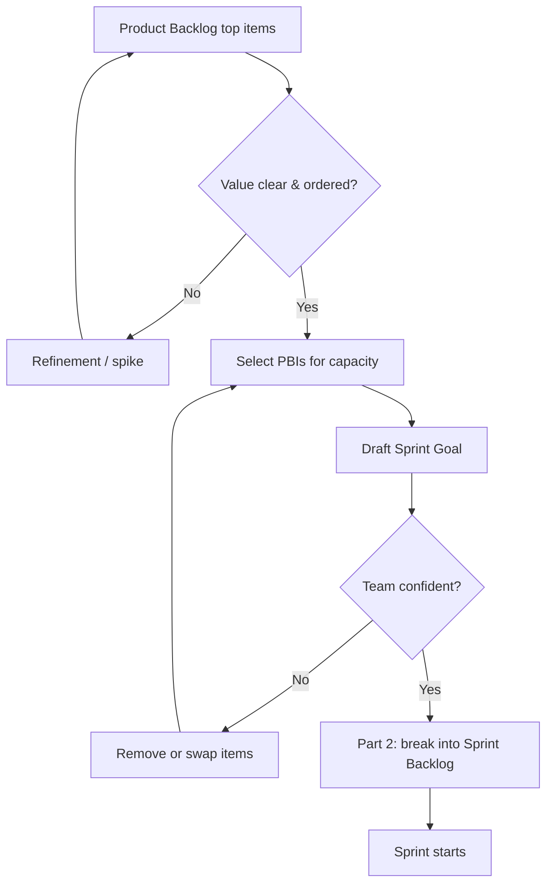
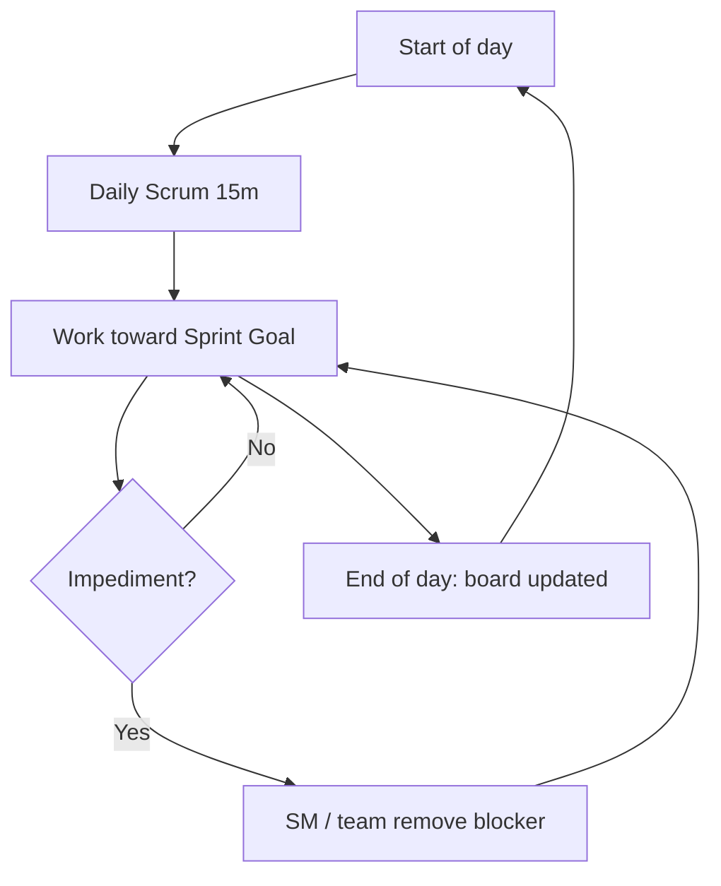
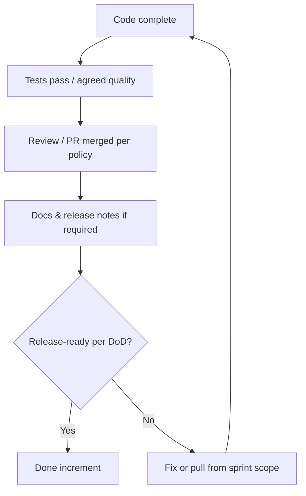
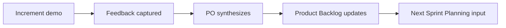

# Scrum — major processes & flow maps

Mermaid diagrams below render on GitHub and in many Markdown viewers. For print/PDF, export from Mermaid Live or duplicate in draw.io.

## 1. Sprint lifecycle (high level)

## 2. Planning flow (Part 1 → Part 2)

## 3. Daily execution loop

## 4. Definition of Done gate (increment)

## 5. Stakeholder feedback loop (Review → Backlog)

## 6. Cross-phase mapping (A–F) in one sprint

| Phase | Where it happens in Scrum |
|-------|-------------------------|
| A Shape | Continuous refinement + PO/stakeholder work |
| B Plan | Sprint Planning |
| C Build | Sprint execution + Daily Scrum |
| D Verify | DoD, testing in sprint, Review validation |
| E Release | Ship when business chooses (increment is releasable) |
| F Operate & learn | Retrospective; production learnings feed backlog |

## 7. Flow details (walkthrough)

**Sprint lifecycle** — Refinement keeps the top of the Product Backlog transparent enough for Sprint Planning to commit. Inside the Sprint, the Daily Scrum inspects progress toward the Sprint Goal; Sprint Review inspects the increment with stakeholders; Sprint Retrospective improves how the team works. Review and Retro outputs feed the next refinement and planning cycle (empirical process: transparency, inspection, adaptation).

**Sprint Planning** — Part 1 clarifies *why* this Sprint matters: ordered backlog items; if value or ordering is unclear, return to refinement or a timeboxed spike. Developers select work that fits capacity and agree one Sprint Goal; if confidence is low, remove or swap items. Part 2 breaks work into a plan (often a Sprint Backlog); the Sprint starts when the team agrees how it will meet the goal.

**Daily execution** — The Daily Scrum is a 15-minute inspect-and-adapt for Developers toward the Sprint Goal; detailed problem-solving happens outside the timebox. Impediments are cleared through the day. The board or backlog should reflect reality by end of day.

**Definition of Done** — Work is only Done when it meets the shared DoD so the increment stays releasable and transparent. Otherwise fix quality or negotiate scope with the Product Owner—do not label incomplete work as Done.

**Review → backlog** — The Review grounds discussion in a working increment; the Product Owner synthesizes stakeholder feedback into Product Backlog ordering and clarity for the next Sprint Planning.

## 8. Authoritative sources & further reading

- [The Scrum Guide](https://scrumguides.org/scrum-guide.html) — Official definition of Scrum (events, accountabilities, artifacts).
- [Scrum.org — What is Scrum?](https://www.scrum.org/resources/what-is-scrum) — Learning-oriented intro; complements the Guide.
- [Agile Alliance — Scrum (glossary)](https://www.agilealliance.org/glossary/scrum/) — Short glossary entry alongside the Guide.
- [Kanban Guide for Scrum Teams](https://www.scrum.org/resources/kanban-guide-scrum-teams) — Blending flow practices with Scrum cadence.

Full curated URL list with executive summaries: [`REFERENCE-LINKS.md`](../REFERENCE-LINKS.md).

## 9. Internal links

- [Ceremonies detail](ceremonies-prescriptive.md) · [Foundation](foundation-connection.md) · [Overview](../scrum.md)
