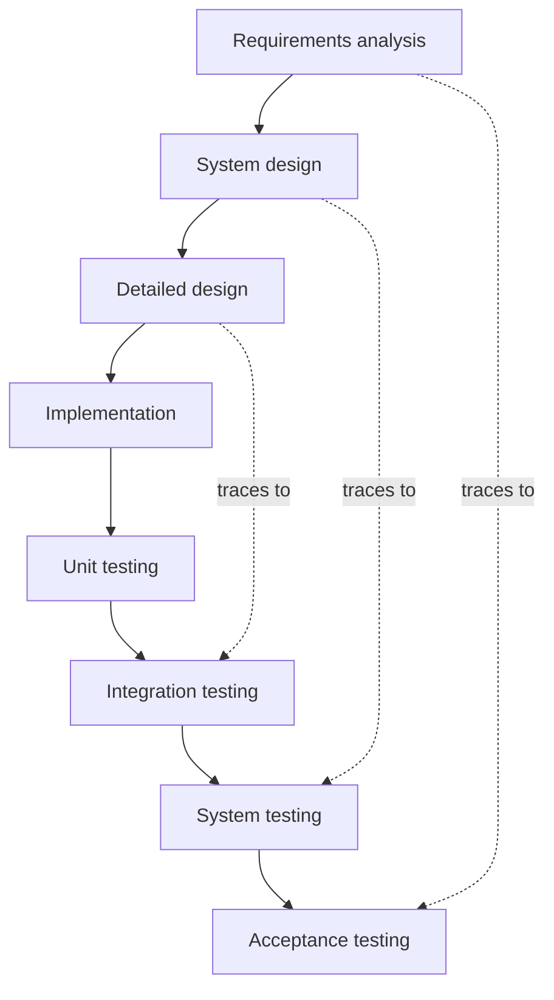
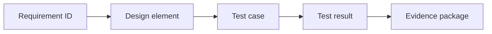
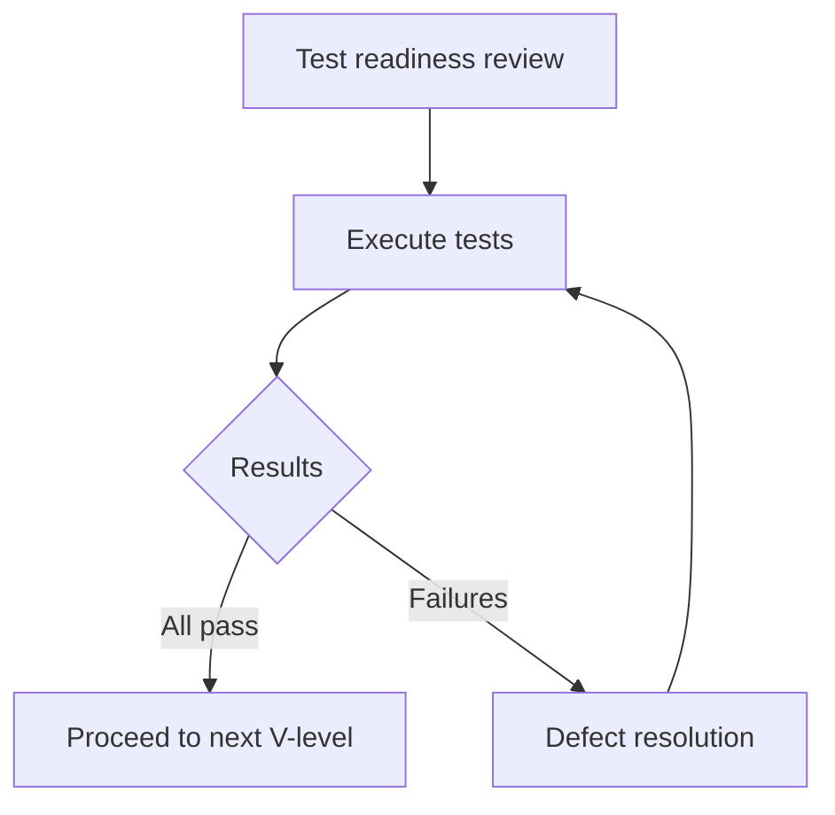
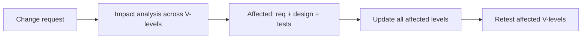

# V-Model — major processes & flow maps

## 1. V-Model structure (classic)

Left side descends (decomposition); right side ascends (integration and verification). Dotted arrows show traceability pairing.

## 2. Traceability flow

## 3. Test-level gate decision

## 4. Change impact (V-Model perspective)

A change to a requirement potentially impacts design, implementation, and tests at multiple V-levels.

## 5. Phases A–F (V-Model mapping)

| Blueprint phase | V-Model locus |
|-----------------|---------------|
| A Shape | Stakeholder needs; concept of operations |
| B Plan | Requirements analysis + acceptance test planning (paired) |
| C Build | System design → detailed design → implementation (left side descent) |
| D Verify | Unit → integration → system testing (right side ascent) |
| E Release | Acceptance testing; deployment readiness |
| F Learn | Operational validation; field feedback; lessons for next cycle |

## 6. Flow details (walkthrough)

**V-Model structure** — The V is not just a picture; it encodes a discipline. Each left-side level produces specifications that the corresponding right-side level will verify. Test planning happens during design, not after coding. This early pairing catches specification issues before they become implementation defects.

**Traceability** — The requirement-to-evidence chain is the V-Model's core deliverable. Every requirement must be testable, every test must trace to a requirement, and every test result must be recorded. Gaps in traceability indicate either missing tests or unnecessary requirements.

**Test-level gates** — Each V-level has an entry check (test readiness) and exit check (test results). Failures feed back to the corresponding development level for resolution, not to a generic "fix bugs" phase.

**Change impact** — Changes in the V-Model are expensive because they ripple across levels. Impact analysis must consider all affected V-levels: a requirement change may require design updates, code changes, and retesting at unit, integration, system, and acceptance levels.

## 7. Authoritative sources & further reading

- [Wikipedia — V-model (software development)](https://en.wikipedia.org/wiki/V-model_(software_development)) — Stable overview.
- [Wikipedia — Verification and validation](https://en.wikipedia.org/wiki/Verification_and_validation) — V&V concepts.
- [ISO 26262 (catalogue)](https://www.iso.org/standard/68383.html) — Automotive functional safety (V-Model-aligned).
- [IEC 62304 (catalogue)](https://www.iso.org/standard/71604.html) — Medical device software lifecycle.

Full curated list: [`REFERENCE-LINKS.md`](../REFERENCE-LINKS.md).

## 8. Internal links

- [Ceremonies](ceremonies-prescriptive.md) · [Overview](https://forgesdlc.com/methodologies-v-model.html)
