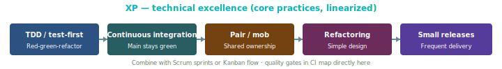

# Extreme Programming (XP)

## What it is

**Extreme Programming (XP)** is a discipline of software development based on **values** (communication, simplicity, feedback, courage, respect) and **practices** that emphasize **technical excellence**: test-driven development, continuous integration, small releases, refactoring, collective ownership, and **pair programming** (or mob/ensemble). XP is often combined with **Scrum** (cadence) or **Kanban** (flow).

## Process diagram (handbook)

*TDD, CI, pairing, refactoring, and small releases interleave daily; the diagram orders them for readability.*

---

## Authoritative sources (external)

| Resource | Executive summary (why it’s linked here) |
|----------|------------------------------------------|
| [Wikipedia — Extreme programming](https://en.wikipedia.org/wiki/Extreme_programming) | **Encyclopedia overview** of practices and history—stable entry before books or blogs. |
| [Agile Alliance — Agile glossary](https://www.agilealliance.org/agile101/agile-glossary/) | **Searchable terms**—find *Extreme Programming* and related Agile vocabulary. |
| [Ron Jeffries — XP](https://ronjeffries.com/xprog/) | **Practitioner** site—stories and guidance from a central XP voice. |
| [martinfowler.com — XP (Bliki)](https://martinfowler.com/bliki/ExtremeProgramming.html) | Short **expert** summary on a widely cited blog—quick read. |

**Note:** Kent Beck’s *Extreme Programming Explained* is the classic book; purchase or library for full narrative.

---

## Practices (summary)

| Practice | Intent |
|----------|--------|
| **Test-driven development** | Red–green–refactor; executable specification. |
| **Continuous integration** | Integrate often; keep trunk/main green. |
| **Refactoring** | Improve design without changing behavior. |
| **Small releases** | Reduce batch size and risk. |
| **Pair programming** | Knowledge sharing, review in the moment. |
| **Collective code ownership** | Anyone can improve any module. |
| **Coding standard** | Shared style reduces friction. |
| **Sustainable pace** | No heroics as a norm; overtime is an exception signal. |

---

## Mapping to this blueprint’s SDLC

| XP practice | Blueprint touchpoint |
|-------------|----------------------|
| CI | [`SDLC.md`](../SDLC.md) §7, project `docs/development/CI-CD.md`, handbook [`cicd.html`](../docs/cicd.html). |
| Testing | Story DoD, [`templates/TEST-PLAN.template.md`](../templates/TEST-PLAN.template.md). |
| Small increments | Phase D build; link commits to work-unit IDs. |

**Ceremonies:** XP practices as **intent types** — [`ceremonies/xp.md`](ceremonies/xp.md) · [foundation](ceremonies/ceremony-foundation.md).

**Roles:** how XP **merges Assure into Build** via practices and keeps **Demand** close—[`roles-archetypes.md`](roles-archetypes.md) §2, §4, §5 (Methodology tweaks **XP**).

---

## Agentic SDLC: XP + agents + tracking

XP’s **technical** bar pairs well with **agents** if you **keep humans in the loop**:

| Topic | Guidance |
|-------|----------|
| **TDD** | Agents can propose tests and code; **human** confirms intent and edge cases. |
| **Pairing** | Human–agent pairing is a common pattern; record **Co-authored-by** or team norms if attribution matters. |
| **CI as safety net** | More important when volume of change increases — gates in CI are non-negotiable. |
| **Sustainable pace** | Agent throughput can mask **review debt**; watch WIP on review and **defect escape** rate. |
| **Tracking foundation** | Quality signals (CI) correlate with commits; they are a **parallel stream**, not redefined as “contributor” in the foundation model. |

---

## Prescriptive deep dive (teams)

Package **[`xp/README.md`](xp/README.md)** — foundation fit, customer/coach/developers, iteration events, TDD/CI loop maps. Handbook: [`methodologies-xp-foundation.html`](../docs/methodologies-xp-foundation.html) through [`methodologies-xp-process.html`](../docs/methodologies-xp-process.html).

---

## Further reading

- [Wiki.c2.com — Extreme Programming Roadmap](https://wiki.c2.com/?ExtremeProgrammingRoadmap) — **Classic wiki** index of XP topics; dated but historically influential.  
- Companion: [Scrum](scrum.md), [Kanban](kanban.md), [Agentic SDLC](agentic-sdlc.md)