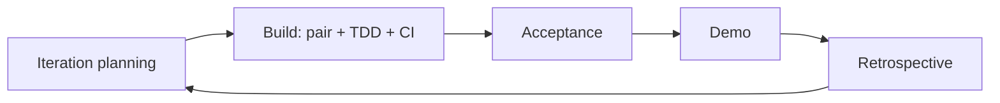
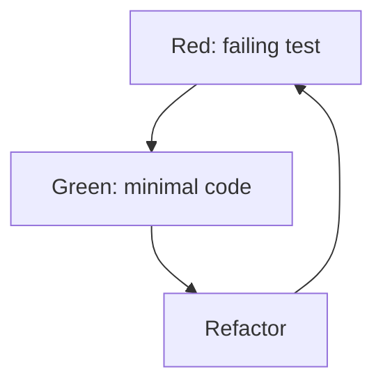
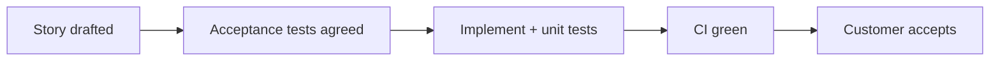
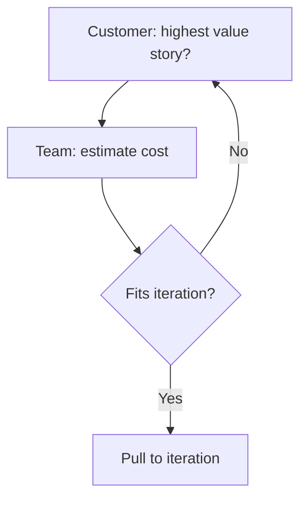

# XP — major processes & flow maps

## 1. Iteration loop

## 2. TDD micro-loop (within story)

## 3. Story lifecycle

## 4. Planning game (priorities vs estimates)

## 5. Phases A–F (XP locus)

| Phase | Typical XP locus |
|-------|------------------|
| A Shape | Stories with customer; release themes |
| B Plan | Iteration planning; tasks |
| C Build | Pairing, TDD, CI |
| D Verify | Acceptance tests; collective ownership |
| E Release | Small / frequent releases |
| F Learn | Production feedback; retrospective |

## 6. Flow details (walkthrough)

**Iteration loop** — Short iterations: plan a small story batch, build with pairing/TDD/CI, acceptance, demo with customer, retrospective; replan with what you learned.

**TDD** — Red (failing test) → Green (minimal code) → Refactor (keep tests green); repeat within the story so design stays test-guided and CI catches regressions.

**Story lifecycle** — Acceptance tests agreed before implementation define customer-visible *done*; then implement with unit tests and green CI; customer acceptance closes the story.

**Planning game** — Customer orders by value; team estimates; pull stories until capacity fits. If top value does not fit, split, defer, or negotiate scope explicitly.

## 7. Authoritative sources & further reading

- [Wikipedia — Extreme programming](https://en.wikipedia.org/wiki/Extreme_programming) — Stable overview of practices and history.
- [Agile Alliance — Agile glossary](https://www.agilealliance.org/agile101/agile-glossary/) — Shared vocabulary.
- [Ron Jeffries — XP](https://ronjeffries.com/xprog/) — Practitioner site.
- [Martin Fowler — XP (Bliki)](https://martinfowler.com/bliki/ExtremeProgramming.html) — Short expert summary.
- [Wiki.c2 — Extreme Programming Roadmap](https://wiki.c2.com/?ExtremeProgrammingRoadmap) — Classic wiki index of XP topics.

Full curated list: [`REFERENCE-LINKS.md`](../REFERENCE-LINKS.md).

## 8. Internal links

- [Ceremonies](ceremonies-prescriptive.md) · [Overview](https://forgesdlc.com/methodology-xp.html)
